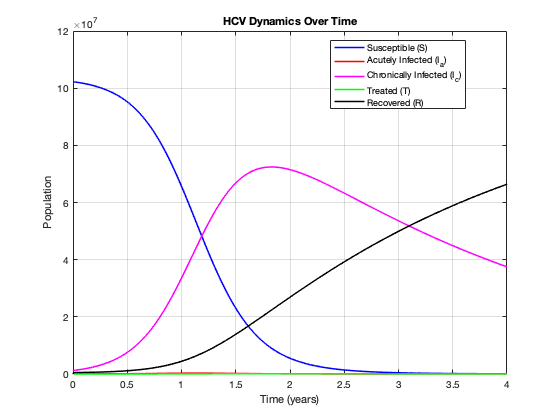
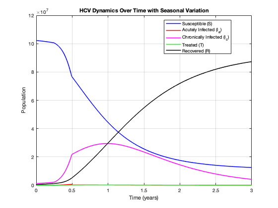

# Mathematical Modeling of Hepatitis C Virus (HCV) Transmission

# Dynamics and Intervention Strategies in Egypt

## Introduction

Hepatitis C virus (HCV) is a major global health concern, impacting roughly 58 million people globally and causing around 290,000 deaths each year[1,2]. This blood-borne pathogen, which mostly affects the liver, can result in chronic infections, cirrhosis, liver failure, and hepatocellular cancer[3]. Its six major genotypes impact disease development and response to therapy, requiring customized public health policies.

Historically, Egypt has high HCV prevalence rates, with estimates ranging from 7 to 10% of the adult population[4]. This unprecedented prevalence is largely attributed to past national initiatives aimed at treating schistosomiasis, during which inadequately sterilized syringes were frequently utilized, resulting in widespread HCV transmission[2].

Considering the intricate dynamics of HCV transmission and the challenges present in Egypt, this project intends to create a mathematical model to represent the spread of HCV under current intervention strategies. By analyzing the effects of various treatment and transmission factors, we aim to enhance public health initiatives and examine tactics to alleviate the HCV burden, focussing on the implications of mass treatment campaigns and measures to control transmission.

## Background

Hepatitis C Virus (HCV) primarily targets the liver, leading to a range of health conditions ranging from acute infections to severe chronic liver conditions. First discovered in 1998, HCV continues to represent a substantial global health challenge. While direct-acting antivirals (DAAs) have transformed HCV treatment, can cure more than 95% of HCV cases [3], and achieved impressive cure rates, significant obstacles remain.

1. Biology

Hepatitis C virus (HCV) is a single-stranded RNA virus from the Flaviviridae family. It demonstrates genetic variety, with at least seven genotypes and multiple subgroups. Genotype 1 is the most prevalent worldwide, genotype 4 is predominant in Egypt, and genotype 6 is widespread in Southeast Asia[5]. This genetic heterogeneity complicates treatment and epidemiological control, requiring region-specific management procedures for effective control.

Acute HCV infections are often asymptomatic, with less than 20% of patients experiencing symptoms including jaundice, fatigue, or abdominal pain[6]. Spontaneous clearance occurs in 30% (15-45%) of acute infections, the acute phase of HCV infection can persist up to six months, with 70-80% of cases evolving to chronic infection with symptoms including jaundice (40%), fatigue (80%), stomach discomfort (50%), and [5] is confirmed through the detection of anti-HCV antibodies and HCV RNA, with HCV RNA detectable within two weeks of exposure and anti-HCV antibodies appearing approximately eight weeks later[5]. 

Chronic HCV starts to increase the risk of cirrhosis and hepatocellular carcinoma (HCC), accounting for 27% of all cirrhosis cases and 25% of HCC cases worldwide. In chronic HCV, 15-35% of patients will develop cirrhosis after 20 years and 1-3% of these individuals will develop hepatocellular carcinoma (HCC) annually[5] five-year survival rate for

patients with decompensated cirrhosis is approximately 50%[5]. The risk of HCC is 17 times higher in patients with chronic HCV compared to the general population[5] such as male gender, co-infection with hepatitis B or HIV, alcohol consumption, obesity, and insulin resistance can contribute to the progression of HCV from acute to chronic.

2. Mathematical Modeling and Strategic Interventions

Mathematical modelling is crucial for understanding how the Hepatitis C Virus (HCV) spreads and guiding public health efforts to manage the disease. One popular method is using compartmental models, which split the population into categories such as those who are susceptible to the virus, those who are infected, and those who have recovered. These models can predict or model the consequences of various public health actions, such as needle exchange programs or increased access to antiviral treatments, which could help prevent the spread of the virus.

Advanced models extend beyond basic compartments by integrating factors such as individual behaviours and regional variations in healthcare. This method enables more specialized solutions that address the individual needs of different areas, hence increasing the effectiveness of public health programs. Mathematical modelling can also assist in identifying the most cost-effective interventions, allocating resources, and tracking progress toward the WHO’s goal of eliminating HCV by 2030. To attain this goal, efforts must be focused on scaling diagnostics, developing harm reduction initiatives, enhancing treatment access, eliminating stigma, and raising public awareness.

##  Biological Questions

Using an extended version of the SIR model, we can attempt to answer the following questions that hold priority in controlling the spread of Hepatitis C in Egypt.

1. How Does Seasonal Variation Affect Transmission and Disease Burden?

   Seasonal variations can amplify the epidemic burden during certain periods, highlighting the need for targeted interventions during high-transmission seasons.

2. What level of treatment coverage is required to reduce the chronic infection rate to a target level by 2030?

   This can help us estimate the minimum annual treatment rate needed to meet the WHO target of HCV elimination, showing the impact of widespread treatment on reducing transmission and chronic infection rates.

3. How do early detection and intervention alter the progression from acute to chronic infection? What kind of unique strategies can Egypt adopt to tackle stigma and promote effective diagnosis strategies?

   This would help us understand how early intervention and increased screening can reduce chronic HCV cases, particularly in high-prevalence regions and then help Egypt alleviate HCV.

## Mathematical Model

### Assumptions

To simplify the complexity of HCV transmission and recovery, the following assumptions were made:

1. Constant Population

   This simplifies the mathematics involved and is appropriate for short- to medium-term simulations when population dynamics are considerably stable. However, real-world changes in population size and age distribution can have an influence on transmission dynamics, especially as younger groups may experience distinct exposure risks. By excluding demographic changes from the model, treatment interventions may be assessed simply on their influence on disease spread and recovery, regardless of other population characteristics.

2. Transmission

   Transmission is exclusively via direct blood-to-blood contact, with other mechanisms of transmission, such as vertical (mother-to-child) or sexual transmission, deemed insignificant. This emphasis is supported by the fact that blood-to-blood transfer, particularly via unsafe medical practices, is the primary cause of HCV prevalence in Egypt.

3. Homogeneous Mixing

   Every individual in the population is assumed to have an equal chance of interacting with every other person. This standard simplification is appropriate for large populations with complex contact patterns that are difficult to measure. Nonetheless, real-world interaction patterns are rarely uniform, as geographic location, social behaviour, and access to healthcare all contribute to diversity. While this assumption provides a broad overview of HCV transmission, targeted treatments may necessitate more particular information on contact patterns and transmission hotspots.

4. Permanent Immunity

   Recovered persons are assumed to have permanent immunity and that they remain in the recovered compartment (R) indefinitely, with reinfections excluded. Reinfections with HCV are uncommon, particularly when persistent immunity and reduced exposure risks are attributable to behavioural changes. While this simplifies the model, if reinfections occur rapidly, the model may underestimate the long-term challenges of HCV eradication. This assumption stresses the need for recovery and preventative initiatives, while additional precautions may be required for high-risk groups if reinfections occur more frequently.

### Model Derivation

The mathematical model used is given below in Figure 1.

Figure 1: The Model

Variables

- S: Susceptible population
- Ia: Acutely infected population
- Ic: Chronically infected population
- T: Treated population
- R: Recovered population

Parameters

- λ: Transmission coefficient
- α: Progression rate to chronic infec- tion
- τ: Treatment rate
- γ: Treatment recovery rate

Model Equations

The dynamics of the model are governed by the following system of differential equations:

###  Mathematical Translations of the Model Equations

1. Susceptible Population (S):

The susceptible population decreases as people become infected through interactions with acutely or chronically infected individuals. The term −λS (Ia + Ic) describes the rate at which susceptible individuals become infected. The larger the susceptible population or the number of infectious individuals, the faster S declines. This equation captures the entry point of the disease into the population.

2. Acutely Infected Population (Ia):

Ia increases due to newly infected susceptibles at a rate λS (Ia + Ic) but decreases owing to the maturation of acute infections to chronic ones at a rate αIa. Individuals in this compartment can still change their disease status to that of the next stages; hence, it represents an initial stage in infection. This balance between newly infected and progressed-to-chronic-stage reflects infectious dynamics with potential for early intervention of the disease.

3. Chronically Infected Population (Ic):

The chronically infected population grows from the development of acute infections (αIa) and is reduced through their treatment at the rate τIc. This is considered to be the long-run infectious state and may show significant contributions to disease persistence. Effective treatment strategies — a larger rate of treatment τ — reduce the burden of disease in the chronic, longer-lived infectious compartments and serve to reduce transmission further.

4. Treated Population (T):
   
τIc represents the treated population that increases for chronically infected individuals under treatment but decreases as treated individuals recover by γT. This is a compartment of treated individuals on active treatment. Therefore, the size of this population represents the healthcare system’s capacity to manage the infection so that individuals transition through recovery easily.

6. Recovered Population (R):

The recovered population grows as the treated individuals recover, with γT defining the rate of recovery. This is the compartment representing individuals who finish their treatment and are deemed non-infectious. The recovery rate γ determines the final size of the recovered population and thus measures the progress of the epidemic.

##  Dataset

To validate the equilibrium point and simulate the dynamics of hepatitis C virus (HCV) transmission and recovery, we used real-world data from the World Health Organization (WHO). The WHO dataset contained essential statistics such as the number of diagnosed and treated people, diagnostic and treatment coverage rates, and prevalence data as shown in Table[1]. We started by analyzing key epidemiological metrics using the provided dataset on chronic HCV infection: diagnosed population, treatment rates, and prevalence to estimate initial parameter values for our compartmental model. The parameters included the transmission coefficient, progression rate to chronic infection, treatment rate, and recovery rate from treatment. These agreed with the observed trends in the dataset and values reported in the literature. However, we realized that undiagnosed individuals, who constitute a significant part of the susceptible population, were not accounted for in the initial analysis. Hence, we re-estimated the parameters by including the undiagnosed population in the model equations to get:

λ = 1.1 × 10−10, α = 0.85, τ = 0.005, γ = 0.85.

All these adjustments ensured that the model captured the full dynamics of HCV transmission, progression, and treatment, including the hidden burden of undiagnosed cases.

|Metric|Value|
| - | - |
|HCV-infected persons diagnosed (number)|4,438,967|
|HCV diagnosis coverage as percentage of total HCV infected, including cured (%)|191\.4|
|HCV treatment rate as percentage of diagnosed (%)|48\.85|
|HCV cumulative treatment rate as a percentage of total infected, including cured (%)|93\.48|
|New HCV infections (number)|9,708|
|People living with HCV, including cured (adjusted number)|4,328,245|
|People living with HCV (number)|484,523|
|Persons initiated HCV treatment (number)|5,000|
|Persons on HCV treatment, cumulative (number)|4,046,024|
|Prevalence of HCV in the general population (%)|0\.44|

Table 1: WHO Data on HCV

The data confirmed the high progression rate of acute HCV cases to chronic infection, estimated at 85%. This highlights the aggressive nature of the disease and the importance of early intervention. Second, the dataset demonstrated the effectiveness of Egypt’s awareness campaigns and treatment programs, achieving a 48.85% treatment rate among diagnosed individuals. However, the dataset does not provide estimates of undiagnosed cases, making it difficult to assess the full burden of the disease. Despite high treatment and diagnosis rates, a considerable number of individuals remain infected, illustrating that HCV persists within the population.

##  Model Analysis

1. MATLAB Simulation

The simulation from MATLAB shown in Figure 2  provides a thorough perspective of HCV dynamics under Egypt’s existing public health measures. If Egypt maintains its current intervention program, the model anticipates a large increase in chronic infections over the following two years starting from 2022. This increase is primarily due to the evolution of acute infections into chronic stages, which is impacted by treatment delay and the efficacy of existing treatments. However, after two years, the chronic infection curve begins to reduce as more people obtain effective treatment, resulting in a steady increase in the recovered population and a reduction in the susceptible population.

Figure 2: Simulation of the different populations with the year 2022 as base level

The green curve represents the behaviour of the treated population, which is an important aspect of the simulation. The treated individuals are quickly shifted to the recovered compartment due to the high treatment recovery rate (γ = 0.85). This prevents the treated population from growing over time, ensuring that the green curve remains low throughout the experiment. As a result, most people move from a chronic infection state to recovery, demonstrating the effectiveness of treatment programs in lowering the total disease burden. This shows that high treatment recovery rates are critical in preventing the spread and long-term effects of the infection.

2. Reproduction Number

Next-Generation Matrix Method

The next-generation matrix method is a mathematical framework used to calculate R0 in compartmental models. It involves defining the model’s transition rates between compartments (e.g., susceptible to acutely infected, acutely infected to chronic, etc.) and constructing a matrix representing the expected number of new infections in each compartment. By analyzing the eigenvalues of this matrix, researchers can determine the basic reproduction number (R0). In our model, R0 came out to be:

These transitions are influenced by factors such as the transmission rate (λ), the progression rate to chronic infection (α), and the treatment rate (τ), all of which play significant roles in determining the disease’s spread.

The reproduction number (R0) is a key epidemiological metric representing the average number of secondary infections caused by a single infected individual in a fully susceptible population. The reproduction number is critical in determining the potential for disease spread. A value of R0 > 1 implies that the disease can spread within the population, but R0 < 1 indicates that the disease is unlikely to sustain itself.

In this study, the reproduction number was estimated using the next-generation matrix method, which is commonly used in epidemiology. In our model, the reproduction number was found to be R0 = 0.00000022 which is significantly less than 1. This confirms that the disease-free equilibrium is stable, and the disease will not spread effectively within the population. The low R0 value suggests that the illness has very poor transmissibility under current conditions. In practical terms, this means that each infected individual is unlikely to infect even one other person, suggesting that the infection is unlikely to sustain itself in the population without external interventions or changes in the model’s dynamics.

3. Sensitivity Analysis

Sensitivity analysis is used to determine how sensitive the model’s outputs are to changes in the parameters. By changing the values of critical parameters, we may determine which factors are the most influential on disease dynamics to formulate intervention plans to attain the best disease control results. In this simulation, sensitivity analysis was performed for the following parameters:

- Transmission Rate ( λ): The transmission rate determines how easily the virus spreads between susceptible and infected individuals. In the model, λ = 1.1 × 10−10, a value chosen based on available data on HCV transmission. Sensitivity analysis shows that even small changes in λ lead to proportional changes in the disease spread. A 1% increase or decrease in λ causes a 1% change in the number of new infections, indicating that targeting transmission reduction (e.g., through preventive measures or public health campaigns) could largely impact disease control.

- Progression Rate ( α): The progression rate represents the rate at which acute infections progress to chronic ones. In our model, α = 0.8, reflects the typical progression of HCV infections. Analysis shows that changes to α have a minimal impact on overall disease dynamics. A 1% increase or decrease in α leads to only a 0.01% change in the results, suggesting that interventions targeting the progression from acute to chronic infection may have limited effects compared to other parameters.
  
- Treatment Rate ( τ): The treatment rate determines how quickly infected individuals are identified and treated. τ = 0.005 was chosen based on data regarding treatment accessibility and effectiveness. Analysis revealed that τ has a major impact on disease progression. A 1% increase in τ results in a 0.98% decrease in chronic infections, while a 1% decrease in τ leads to a significant increase in chronic cases. This demonstrates that enhancing treatment rates (e.g., through mass treatment campaigns or improved healthcare infrastructure) can considerably reduce the number of chronic infections and improve disease control.

4. Impact of Reduced Treatment Rates

To evaluate the significance of treatment, the simulation was rerun with reduced treatment rates (τ) as shown in Figures 3 and 4. When τ was reduced from 0.005 to 0.001, the number of chronically infected individuals grew dramatically, while the curve for treated persons shifted downwards. This dramatic shift in the model’s behaviour emphasizes the importance of the treatment rate in disease control. Inadequate treatment strategies would result in more people lingering in the chronic infection compartment, contributing to a greater disease burden.

In conclusion, the simulation shows that Egypt’s current HCV intervention strategy, if continued, will likely result in a reduction in chronic infections over time, especially if the treatment rate remains high. The low reproduction number (R0 = 0.00000022) indicates that the disease is unlikely to spread effectively, emphasizing the success of existing treatment and preventative measures. However, sensitivity analysis shows that tiny changes in important factors, particularly the treatment and transmission rates, can drastically affect the disease’s trajectory. As a result, maintaining the treatment rate and prioritizing transmission reduction techniques will be critical for Egypt’s long-term progress and management of HCV.

Figure 3: When τ = 0.005                                     

Figure 4: When τ = 0.001

##  Answering the Biological Questions

### How Does Seasonal Variation Affect Transmission and Disease Burden?

Figure 5: Without Seasonal Variation 

 

Figure 6: With Seasonal Variation

To account for seasonal fluctuations in disease transmission, we insert peak months, which generally occur between April and June, into the model to produce the plots in Figures 5 and 6. These can be represented as a stepwise function for λ(t), with greater values during peak times, or a smooth sinusoidal/logistic function for progressive variations. Comparing these methodologies reveals the seasonal influence on infection rates, chronic cases, and recovery trends, with step models representing abrupt shifts and smooth models accounting for environmental impacts. High-transmission months may speed up acute infections and chronic illnesses if treatments are delayed, but they also offer opportunities for improved recovery through greater testing and treatment. Targeted treatments, such as behavioural campaigns, gamified applications, and public screenings during cultural events, as well as localized initiatives like hotspot mapping or temporary medical camps, can prevent transmission and mitigate the epidemic’s impact.

### What level of treatment coverage is required to reduce the chronic infection rate to a target level by 2030?

Figure 7: Chronic Infections v/s Treatment Coverage

Egypt aims to eliminate Hepatitis C by 2030, as set by the WHO. Our goal is to determine the treatment coverage required to reduce the chronic infection rate to zero by then. If treatment coverage increases to 0.05, chronic infections cease. Currently, Egypt must increase treatment by a factor of 10 as seen in Figure 7. Achieving this requires expanding access to treatment, and early detection, improving health infrastructure and interventions like screening programs and increasing DAA access, and overcoming barriers like cost, accessibility, and stigma. Egypt must not rely on natural disease decline but instead increase awareness to reduce transmission or enhance treatment rates by improving healthcare access, especially for high-risk populations.

### How do early detection and intervention alter the progression from acute to chronic infection? What kind of unique strategies can Egypt adopt to tackle stigma and promote effective diagnosis strategies?

The treatment rate τ is defined as:

τ = diagnosis rate × uptake factor

where the Diagnosis Rate (δ) is the rate at which infected individuals are identified through testing, and the Uptake Factor (κ) is the proportion of diagnosed individuals who proceed to treatment, influenced by accessibility and willingness.

Figure 8: Chronic Infections and Diagnosis Rate

Increasing the diagnosis rate reduces the chronic infection burden by moving individuals from the chronically infected compartment to the treated one, speeding up the depletion of chronic infections and slowing transmission. We will simulate varying diagnosis rates while keeping the uptake factor constant to assess its impact on the chronically infected population.

Graph analysis: From Figure 8 it can be seen that a higher diagnosis rate (δ) leads to a faster reduction in chronic infections, as illustrated by the blue curve (δ = 0.010) with lower chronic infection levels. In contrast, lower diagnosis rates (δ = 0.001, red curve) result in delayed peaks and higher chronic infections. These findings underscore the importance of increasing diagnosis rates to reduce chronic infections. However, stigma remains a challenge, as individuals may avoid testing or treatment due to fear of social exclusion or discrimination.

Innovative Strategies to Reduce Stigma and Encourage Testing

- Gamified Mobile Apps: Engaging applications through challenges, quizzes, and rewards raises awareness among users about disease prevention and testing, normalizing discussions and decreasing stigma.
- Anonymous Testing with Digital Access: Discreet testing facilities use mobile applications to enable individuals to make private appointments, track test results, and earn points for frequent testing.
- Confidential QR Codes: Self-testing kits distributed via pharmacies without prescriptions include unique QR codes for secure, anonymous results tracking, encouraging testing without the fear of exposure.
- ”Mystery Envelope” Drives: Anonymous testing events provide results in sealed envelopes to maintain privacy and encourage participation.

##  Discussion

The mathematical simulation for HCV provided valuable insights into the transmission dynamics of the disease spread in Egypt and identified key factors influencing its control. While the model demonstrated the effectiveness of Egypt’s public health interventions, such as DAAs and transmission reduction strategies, it also highlighted areas requiring improvement. Sensitivity analysis aided us in realizing that even a small change in treatment and transmission rates significantly impacts the number of chronically infectious individuals, leading to the need for proper healthcare investment and policy support.

Although the model’s assumptions simplify real-world complexities, future research on this topic can address these shortcomings by taking into account variables like seasonal variations, demographic diversity, and reinfection risks to improve predictions and customize interventions. Seasonal transmission spikes, for instance, could be mitigated through targeted awareness campaigns or localized preventive measures during high-risk periods.

The model implementation emphasizes the importance of early diagnosis, easily available healthcare, and prevention initiatives in reducing the burden of HCV. A pattern for addressing similar global health challenges can be found in Egypt’s progress, which shows that combining strong public health measures with mathematical modelling can lead to significant advancements in the elimination ofthe disease.

##  Conclusion

Mathematical simulation of the HCV (Hepatitis C) virus transmission mechanism in Egypt, intervention modalities to control and reduce the infection load. We applied a compartmental model to investigate the role of treatment rates, transmission suppression, and recovery in spreading and control.

Our research shows that Egypt’s current public health approach — especially direct-acting antivirals (DAAs) — can successfully reduce chronic infections. The simulation results show a long-term gradual reduction of the chronic infection rate, under high treatment rates (τ) and successful healing mechanisms (γ = 0.85). This low reproduction number (R0 = 0.00000022) suggests that HCV spread cannot continue as it does in current circumstances, as Egypt’s intervention campaigns have proved.

Sensitivity analysis evaluated the most significant parameters influencing the model’s results were the transmission rate (λ) and the treatment rate (τ). As a result, long-term, easily accessible treatment programs are essential since even small increases in treatment rates effectively reduce chronic infection cases. However, any decrease in treatment will result in a rise in chronic cases, thus legislative changes are necessary to keep funding healthcare infrastructure and expanding access to care.

The paper also highlighted how transmission reduction initiatives – from awareness programs, harm reduction programs, and improved sanitation – can complement treatment to a great extent. These steps can also reduce the chance of contracting new illnesses, especially in susceptible populations. Though it erodes much of the truth due to presumptions such as homogeneous mixing and lifelong immunity, it provides some helpful information about how HCV spreads and recovers. These studies may eventually take into account factors like demographic mix, access to healthcare, and reinfection rates to offer more comprehensive recommendations.

Therefore, our analysis shows that to eliminate HCV by 2030, we must continue to ensure treatment and recovery rates remain high, while the transmission is minimized. Egypt’s progress is a proof-positive of the potential of strong public health management in combination with mathematical modelling to resolve a persistent global health problem.

## References

1. “National Hepatitis C estimates, Canada, 2019, CCDR 48(11/12),” Dec. 2022, last Modified: 2022-12-15. [Online]. Available: [https://www.canada.ca/en/public-health/services/reports-publications/canada- communicable-disease-report-ccdr/monthly-issue/2022-48/issue-11-12-november- december-2022/national-hepatitis-c-estimates-canada-2019.html](https://www.canada.ca/en/public-health/services/reports-publications/canada-communicable-disease-report-ccdr/monthly-issue/2022-48/issue-11-12-november-december-2022/national-hepatitis-c-estimates-canada-2019.html)
1. T. Stroffolini and G. Stroffolini, “Prevalence and Modes of Transmission of Hepatitis C Virus Infection: A Historical Worldwide Review,” Viruses, vol. 16, no. 7, p. 1115, Jul. 2024. [Online]. Available: <https://www.ncbi.nlm.nih.gov/pmc/articles/PMC11281430/>
1. “Hepatitis C.” [Online]. Available: <https://www.who.int/news-room/fact-sheets/detail/hepatitis-c>
1. “The epidemiology of hepatitis C virus in Egypt: a systematic review and data synthesis
   1. PMC.” [Online]. Available: h[ttps://pmc.ncbi.nlm.nih.gov/articles/PMC3702438/](https://pmc.ncbi.nlm.nih.gov/articles/PMC3702438/)
1. S. H. Moosavy, P. Davoodian, M. A. Nazarnezhad, A. Nejatizaheh, E. Eftekhar, and

   8. Mahboobi, “Epidemiology, transmission, diagnosis, and outcome of Hepatitis C virus infection,” Electronic Physician, vol. 9, no. 10, pp. 5646–5656, Oct. 2017. [Online]. Available: <https://www.ncbi.nlm.nih.gov/pmc/articles/PMC5718874/>
1. C.-H. Liu and J.-H. Kao, “Acute hepatitis C virus infection: clinical update and remaining challenges,” Clinical and Molecular Hepatology, vol. 29, no. 3, pp. 623–642, Jul. 2023. [Online]. Available: <https://www.ncbi.nlm.nih.gov/pmc/articles/PMC10366792/>
1. A. Petruzziello, S. Marigliano, G. Loquercio, A. Cozzolino, and C. Cacciapuoti, “Global epidemiology of hepatitis C virus infection: An up-date of the distribution and circulation of hepatitis C virus genotypes,” World Journal of Gastroenterology, vol. 22, no. 34, pp. 7824–7840, Sep. 2016. [Online]. Available: <https://www.ncbi.nlm.nih.gov/pmc/articles/PMC5016383/>
8. A. Kandeel, M. Genedy, S. El-Refai, A. L. Funk, A. Fontanet, and M. Talaat, “The prevalence of hepatitis C virus infection in Egypt 2015: implications for future policy on prevention and treatment,” Liver International, vol. 37, no. 1, pp. 45–53, Jan. 2017. [Online]. Available: <https://www.ncbi.nlm.nih.gov/pmc/articles/PMC5145777/>
8. “Hepatitis - chronic hepatitis treatment rate as percentage of diagnosed.” [Online]. Available: [https://www.who.int/data/gho/data/indicators/indicator-details/GHO/ hepatitis---chronic-hepatitis-treatment-rate-as-percentage-of-diagnosed](https://www.who.int/data/gho/data/indicators/indicator-details/GHO/hepatitis---chronic-hepatitis-treatment-rate-as-percentage-of-diagnosed)
8. “Hepatitis - chronic hepatitis treatment rate as percentage of total infected.” [Online]. Available: [https://www.who.int/data/gho/data/indicators/indicator-details/GHO/ hepatitis---chronic-hepatitis-treatment-rate-as-percentage-of-total-infected](https://www.who.int/data/gho/data/indicators/indicator-details/GHO/hepatitis---chronic-hepatitis-treatment-rate-as-percentage-of-total-infected)
8. “Hepatitis - number of chronic hepatitis-infected persons diagnosed.” [Online]. Available: [https://www.who.int/data/gho/data/indicators/indicator-details/GHO/ hepatitis---number-of-chronic-hepatitis-infected-persons-diagnosed](https://www.who.int/data/gho/data/indicators/indicator-details/GHO/hepatitis---number-of-chronic-hepatitis-infected-persons-diagnosed)
8. “Hepatitis - number of deaths caused by chronic hepatitis.” [Online]. Available: [https://www.who.int/data/gho/data/indicators/indicator-details/GHO/hepatitis--- number-of-deaths-caused-by-chronic-hepatitis](https://www.who.int/data/gho/data/indicators/indicator-details/GHO/hepatitis---number-of-deaths-caused-by-chronic-hepatitis)
8. “Hepatitis - number of persons initiated hepatitis C treatment, latest year and cumulative over a period of years.” [Online]. Available: h[ttps://www.who.int/data/ gho/data/indicators/indicator-details/GHO/hepatitis---number-of-persons-initiated- hepatitis-c-treatment--latest-year-and-cumulative-over-a-period-of-years](https://www.who.int/data/gho/data/indicators/indicator-details/GHO/hepatitis---number-of-persons-initiated-hepatitis-c-treatment--latest-year-and-cumulative-over-a-period-of-years)
8. “Hepatitis - number of persons living with chronic hepatitis.” [Online]. Available: [https://www.who.int/data/gho/data/indicators/indicator-details/GHO/hepatitis--- number-of-persons-living-with-chronic-hepatitis](https://www.who.int/data/gho/data/indicators/indicator-details/GHO/hepatitis---number-of-persons-living-with-chronic-hepatitis)
8. “Hepatitis - prevalence of chronic hepatitis among the general population.” [Online]. Available: [https://www.who.int/data/gho/data/indicators/indicator-details/GHO/ hepatitis---prevalence-of-chronic-hepatitis-among-the-general-population](https://www.who.int/data/gho/data/indicators/indicator-details/GHO/hepatitis---prevalence-of-chronic-hepatitis-among-the-general-population)
16. “Hepatitis - new infections.” [Online]. Available: h[ttps://www.who.int/data/gho/data/ indicators/indicator-details/GHO/hepatitis---new-infections](https://www.who.int/data/gho/data/indicators/indicator-details/GHO/hepatitis---new-infections)
16. “Hepatitis- diagnosis coverage of chronic hepatitis (HBV and HCV) as a percentage of infected.” [Online]. Available: [https://www.who.int/data/gho/data/indicators/indicator-details/GHO/hepatitis- -diagnosis-coverage-of-chronic-hepatitis-(hbv-and-hcv)-as-a-percentage-of-infected](https://www.who.int/data/gho/data/indicators/indicator-details/GHO/hepatitis--diagnosis-coverage-of-chronic-hepatitis-\(hbv-and-hcv\)-as-a-percentage-of-infected)
24
